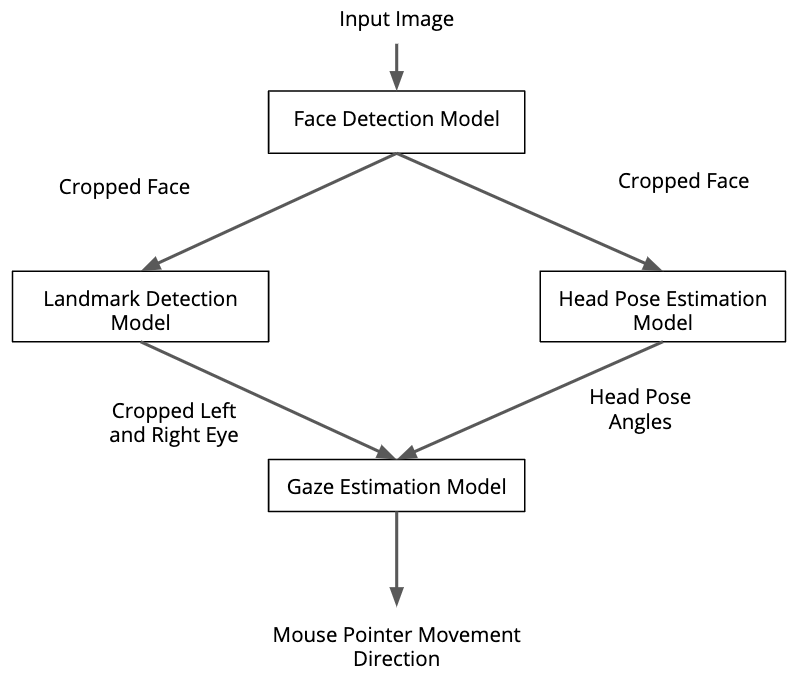

# Eyes Movement Tracking

In this project, you will use several deep learning models from the OpenVINO model zoo for the eyes movement tracking. You will be using the Gaze Estimation model to estimate the gaze of the user's eyes.</br>
Firstly, we will detect the face from the input video by using a face detection model. This detected face then passes it to two models for eyes detection and second for head pose estimation. At the end head pose angle and detected eyes image of left and right eye pass to the gaze estimation model to get the gaze vector. 

We are using four pre-trained models from the Intel Pre-trained Models Zoo:
* [Face Detection](https://docs.openvinotoolkit.org/latest/omz_models_intel_face_detection_adas_binary_0001_description_face_detection_adas_binary_0001.html)
* [Head Pose Estimation](https://docs.openvinotoolkit.org/latest/omz_models_intel_head_pose_estimation_adas_0001_description_head_pose_estimation_adas_0001.html)
* [Facial LandMarks Detection](https://docs.openvinotoolkit.org/latest/omz_models_intel_landmarks_regression_retail_0009_description_landmarks_regression_retail_0009.html)
* [Gaze Estimation Model](https://docs.openvinotoolkit.org/latest/omz_models_intel_gaze_estimation_adas_0002_description_gaze_estimation_adas_0002.html)



## Eyes movement tracking output


## Project Set Up and Installation
Make sure you have the OpenVINO toolkit installed on your system. This project is based on [Intel OpenVINO 2021.3.394](https://docs.openvinotoolkit.org/latest/index.html) toolkit, so if you don't have it, make sure to install it first before continue with the next steps. Read the dependencies listed on the openVINO website to install it.

By using Conda with python==3.6:

```bash
conda install openvino-ie4py-ubuntu18 -c intel
```

You have to install the pretrained models needed for this project. The following instructions are for Linux.
First you have to initialize the openVINO environment
```bash
source /opt/intel/openvino/bin/setupvars.sh
```

You have to run the above command every time you open an new terminal window or activate a conda env.

To download the models run the following commands after you have created a folder with name `model`.</br>
**Face Detection Model**
```bash
python3 /opt/intel/openvino_2021.3.394/deployment_tools/tools/model_downloader/downloader.py --name face-detection-0200 --output_dir Computer-Pointer-Control/models
```
**Facial Landmarks Detection**
```bash
python3 /opt/intel/openvino_2021.3.394/deployment_tools/tools/model_downloader/downloader.py --name landmarks-regression-retail-0009 --output_dir Computer-Pointer-Control/models
```
**Head Pose Estimation**
```bash
python3 /opt/intel/openvino_2021.3.394/deployment_tools/tools/model_downloader/downloader.py --name head-pose-estimation-adas-0001 --output_dir Computer-Pointer-Control/models
```
**Gaze Estimation Model**
```bash
python3 /opt/intel/openvino_2021.3.394/deployment_tools/tools/model_downloader/downloader.py --name gaze-estimation-adas-0002 --output_dir Computer-Pointer-Control/models
```

Install the requirements:
```bash
pip3 install -r requirements.txt
```

**Project structure**
```bash
|
|--bin
    |--demo.mp4
|--model
    |--intel
        |--face-detection-adas-binary-0001
        |--gaze-estimation-adas-0002
        |--head-pose-estimation-adas-0001
        |--landmarks-regression-retail-0009
|--src
    |--face_detection.py
    |--facial_landmarks_detection.py
    |--gaze_estimation.py
    |--input_feeder.py
    |--main.py
|--README.md
|--requirements.txt
```


## Demo
Step 1:  Go back to the project directory src folder
 
 ```
cd Eyes Movment Tracking/src/
```
Step 2: Run below commands to execute the project
 * Run on CPU
 ```
python main.py -i ../bin/demo.mp4 -fd ../models/intel/face-detection-0200/FP16-INT8/face-detection-0200 -hp ../models/intel/head-pose-estimation-adas-0001/FP16-INT8/head-pose-estimation-adas-0001 -fl ../models/intel/landmarks-regression-retail-0009/FP16-INT8/landmarks-regression-retail-0009 -ge ../models/intel/gaze-estimation-adas-0002/FP16-INT8/gaze-estimation-adas-0002 -d CPU -disp TRUE -pt 0.6

```
## Documentation
Below are the command line arguments needed and there brief use case.

Argument|Type|Description
| ------------- | ------------- | -------------
-fd | Required | Path to a face detection model.
-fl | Required | Path to a facial landmarks detection model.
-hp| Required | Path to a head pose estimation model.
-ge| Required | Path to a gaze estimation model.
-i| Required | Path to image or video file or WEBCAM.
-disp| Optional | Flag to display the outputs of the intermediate models.
-pt | Optional | Specify confidence threshold which the value here in range(0, 1), default=0.6
-d | Optional | Provide the target device: CPU / GPU / VPU (MYRIAD) / FPGA


## Benchmarks on CPU
Include the benchmark results of running multiple model precisions. 
 The Performance tests were run on **Intel® Core™ i3-8350K CPU @ 4.00GHz × 4** and **16 GB Ram**


| Properties  | FP32        | FP16        | INT8        |
| ------------| ----------- | ----------- | ----------- |
|Model Loading| 0.19139     | 0.183228    | 0.35699     |
|Infer Time   | 75.9599     | 75.77568    | 68.5793     |
|FPS          | 0.77672     | 0.77861fps  | 0.8603fps   |


## Results
We notice the models with low precisions generally tend to give better inference time, but it still difficult to give an exact measures as the time spent depend of the performance of the machine used in that given time when running the application. Also we notice that there is a difference between the same model with different precisions.

The models with low precisions are more lightweight than the models with high precisons, so this makes the execution of the network more fast.

### Edge Cases
The app needs exactly one face to appear in a frame. If there are many, it picks the first one which has a detection confidence not less than a threshold value. In case a face cannot be confidently detected, this frame is not used for mouse control (the output window shows the original frame and the mouse pointer's position remains the same). Possible reasons for detection to fail are bad lighting (too dark or too bright), angle shot, face occlusion. 
